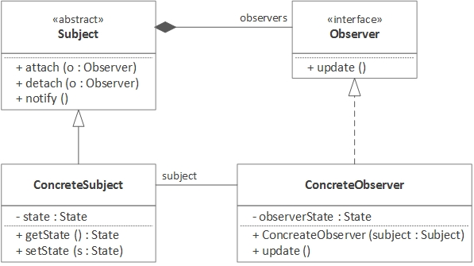

# Illustration of the <a href="https://refactoring.guru/design-patterns/observer" target="_blank">Observer Design Pattern</a>

Observer pattern is used when there is one-to-many relationship between objects such as if one object is modified, its dependent objects are to be notified automatically.
## UML

