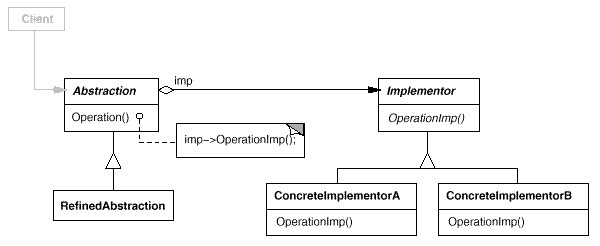

# Illustration of the [Bridge Design Pattern](https://refactoring.guru/design-patterns/bridge)

The Bridge Design Patterns separates a big class, or a group of tightly entangled classes into two hierarchies called "abstraction" and "implementation", in order for the two of them to change independently.

## UML

