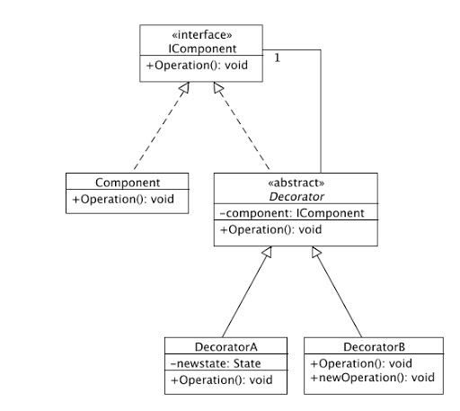

# Illustration of the [Decorator Design Pattern](https://refactoring.guru/design-patterns/decorator)

By using the Decorator Design Pattern we can alter the behaviour of the object without changing its content. All of this happens at runtime.

## UML

